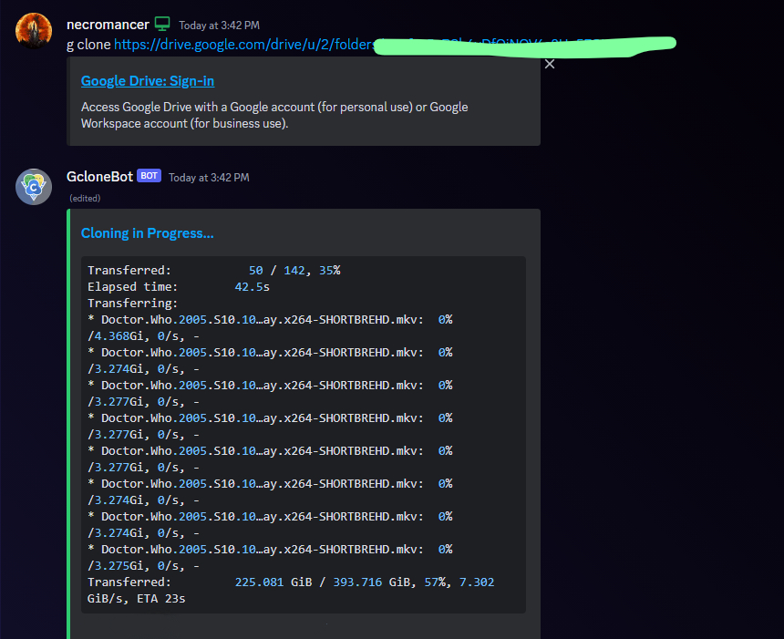
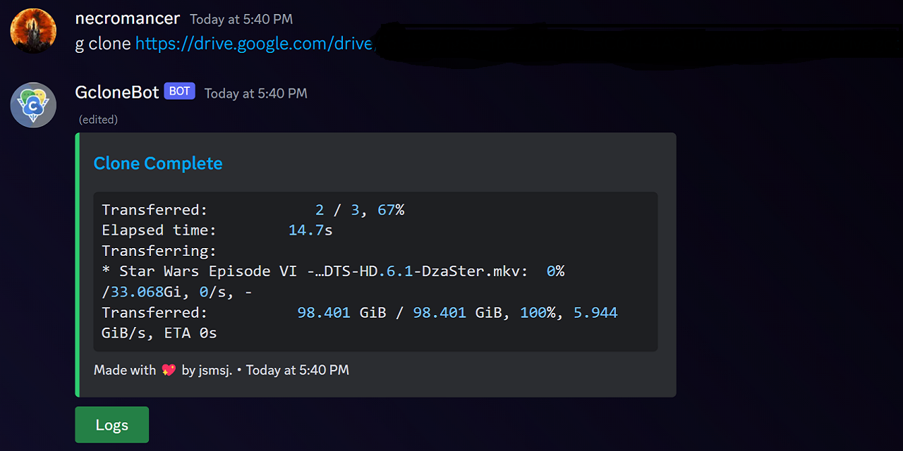

# Gclone Discordify

### Features:
1. Copy from one google drive folder to another.

## How to host?
1. First make a discord bot at developer portal and enable all intents. ([tutorial](https://www.freecodecamp.org/news/create-a-discord-bot-with-python/))
2. Download the repository.
3. Put 100 .json service accounts into [accounts folder](accounts/) and delete [this file](accounts/put%20service%20account%20files%20here).
4. Make sure the accounts are named as 0.json, 1.json, 2.json and so on.
5. Add Discord Bot token and Defaut folder id to [.env](.envfile) and rename the [.envfile](.envfile) to `.env`.
6. Optional: Make a virtual environment
7. Run `pip install -r requirements.txt`
8. Run `python main.py`
9. Enjoy cloning, the command is `prefix clone source_folder_url destination_folder_url`
> [ If destination_folder_url is empty then it will clone to default folder as set in [env](.envfile). ]

----

----

Currently it has only feature to clone links as that is most used. more gclone features can be added, you can make an issue in github.

> ## DM jsmsj#5252 for recommendations